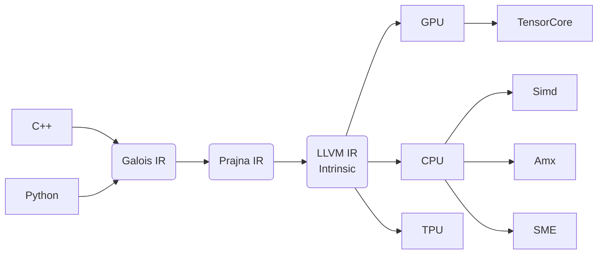

# Galois Platform

The Galois compiler is a tensor computation compiler which targets at TPUs, GPUs, and CPUs. Around this compiler, we  build a comprehensive computation platform.

Galois provides a powerful software stack for artificial intelligence and scientific computing, offering a unified programming paradigm. With a primary focus on Large Language Models (LLMs), the platform also accommodates areas such as finite element analysis, computer graphics, and computer vision. Currently, our engineering efforts are centered around enabling LLM deployment.



As shown in the diagram, Galois is built around the Galois IR. By applying automatic optimizations to Galios IR, we can achieve optimal performance across various hardware platforms.

## Key Features of the Galois Software Stack

There are already many AI infrastructures centered around compilers. Galois draws from these systems, incorporating their ideas and advantages. In our initial roadmap, Galois demonstrates several features:

### With IR Based on Affine Expression as the Core, Multi-Level IR Smoothing Is Excessive

### Programming Based Tile Instead of Thread

Matrix multiplication is the core computation of LLMs. Both hardware and software achieve efficiency by processing data in blocks. Therefore, programmability should focus on blocks rather than individual threads.

### Hybrid Static-Dynamic Graphs with JIT Execution

We dynamically construct the computation graph in the host language (C++ or Python), then extract a static computation graph for Galois to optimize and compile into an executable. A key benefit of JIT execution is that dynamic shapes from the host become static (constant) shapes in Galois, significantly improving compiler optimization.

### Hardware-Software Co-Design

Software and hardware should evolve collaboratively rather than constrain each other. For example, software can pack data in a structured format for hardware rather than relying on hardware to handle scattered data. Similarly, hardware should offer efficient and programmable interfaces for software.

### Unified Hardware Abstraction

We extend the concept of storage beyond cache, memory, and disk to include cluster-level storage, viewing them as hierarchical storage layers. Likewise, read/write operations are extended to network communication. This design makes distributed computing a fundamental part of Galois, with no exposed distributed logic. Galois aims to automatically distribute computation expressions across hardware resources.

## How to Use

### Download the Source Code

First,download the source code.The repository contains a large number of dependencies. Be patient if no error occurs. It's recommended to set up `git` with an HTTPS proxy (search online for guides) for smoother GitHub access.

```bash
#download the code
git clone https://github.com/galois-stack/galois
```

### Dependencies on Ubuntu 20.04

```bash
apt install git clang wget libgnutls28-dev libsodium-dev uuid-dev build-essential libssl-dev cmake ninja-build
```

You can also refer to `dockerfiles/ubuntu_dev.dockerfile` for configuration.

### Compile

You can build Galois in a Docker environment or configure the environment yourself by following the [Dockerfile](../dockerfiles/ubuntu_dev.dockerfile). It's notable that Prajna currently only supports the Clang compiler. You may need to manually adapt it for GCC or other compilers.

```bash
./scripts/clone_submodules.sh --jobs=8 --depth=50 # Download dependencies
CXX=clang++ CC=clang ./scripts/configure.sh release # Configure for release mode
./scripts/build.sh release
./scripts/test.sh release # Optional: run tests
```

You can replace `release` with `debug` to switch to debug mode.

## Join the Community

The Galois project is in its early stages. We welcome developers interested in AI infrastructure, compiler optimization, and LLM technologies to join us. No prior experience is required, Galois is looking forward to learning and growing with you.

Follow the official WeChat account “玄青矩阵” for more updates and future posts.

Feel free to connect with the author on WeChat at “zhangzhimin-tju” for discussion and learning.
