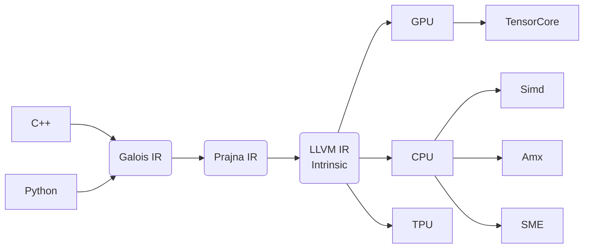

# Galios平台

galios编译器是一个面向TPU, GPU和CPU的张量计算编译器. 围绕该编译器我们将构建了一个计算平台.

galios为人工智能和科学计算等提供强有力的软件栈, 为其提供统一的编程范式. 将LLM视为第一需求, 兼顾有限元分析, 计算机图形和计算机视觉等领域.
目前我们以LLM的工程落地为核心需求和目标



如上图所示, Galois是以Galois IR为核心构建的. 通过对Galios IR的自动优化在不同的硬件设备上获取理想的性能.

## galois软件栈的特点

现已有很多以编译器为核心组件的人工智能基础设施, galois会充分借鉴他们理念和优点. galois的初步产品规划中, 展现出来了以下特点.

### 基于仿射表达式的IR为核心, 多层次IR平滑过度

### 基于块而不是线程去编程

矩阵乘法是LLM的核心运算. 矩阵乘法的高效实现在软硬件上是对应的, 都是分块处理. 所以可编程性应该体现在块上, 而没有必要精细到线程.

### 动静结合, JIT执行

我们会在宿主语言(c++或者python)中动态构建计算图, 然后从中抽离出静态计算图将其交给galois优化后生成可执行程序. JIT执行的关键优势是, 宿主中的动态shape在galois里会变成静态(常量)shape, 这是非常利于编译器优化的.

### 软硬协同发展

软硬件协同发展, 而不是相互钳制. 软件可以通过Pack等方式为硬件提供工整的数据, 而不是让硬件去处理一些碎片的场景.
硬件也应当为软件提供良好可编程性的高效硬件.

### 统一的硬件抽象

将存储的概念, 从缓存, 内存, 硬盘等拓展到集群存储, 将它们视为不同层级的存储.
相应的读写概念, 也从缓存, 内存, 硬盘读写等拓展到网络通讯.
这意味着galois平台设计之初就考虑分布式的计算, 并且分布式的逻辑不会外漏. galois寻求直接将计算表达式自动分发到不同硬件上去.

## 如何使用

### 下载源码

首先我们下载源码, 下载的库会比较多, 如果没有报错请耐心等待, 建议配置git的https.proxy(自行查阅资料), 以便能流畅下载github的代码

```bash
# 下载代码
git clone --recursive https://github.com/galois-stack/galois --jobs=16
```

"--jobs=16"表示同时下载submodule的任务数, 可自行设定. "--recursive"表示下载内部的submodules, 如果这里省略的话, 得自行下载submodules.

如果在下载的代码中出现错误频繁出现错误,  可查阅[git submodule](https://git-scm.com/book/en/v2/Git-Tools-Submodules)

### Ubuntu 20.04 需要安装的一些依赖库

```bash
apt install git clang wget libgnutls28-dev libsodium-dev uuid-dev build-essential libssl-dev cmake
```

也可以参考"dockerfiles/ubuntu_dev.dockerfile"来配置

### 编译

可以使用docker的环境来编译代码, 也可以自行参阅[dockerfile](../dockerfiles/ubuntu_dev.dockerfile)来配置环境.
值得注意的是目前Prajna只支持Clang的编译器, 若使用GCC或其他编译器可能需要自己适配.

```bash
./scripts/configure.sh release # 配置为release模式
./scripts/build.sh release
./scripts/test.sh release # 我们可以通过改指令来运行测试, 这是非必须的步骤
```

例子里使用了"release"模式, 当然我们也可以使用"debug"模式.

## 期待更多开发者加入社区

galois项目处于起步阶段, 欢迎对AI基础设施,编译器优化和LLM相关技术感兴趣的朋友加入到项目中来. 并不需要志愿者有什么相关基础, galois期待和大家一块学习成长.

关注"玄青矩阵"微信公众号获取更多资讯, 后续会发布更多相关分享

欢迎加作者微信"zhangzhimin-tju", 一起交流学习.
