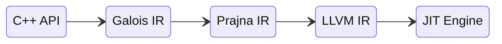

# Galois UML

## 类图

### Galios IR

```plantuml


RealNumberType --|> TensorType
FloatType --|> RealNumberType
IntType --|> RealNumberType


class RealNumberType{
    bits: int64_t
    bytes: int64_t
}

class IntType {
    signed: bool
}


class TensorType{
    value_type: TensorType
    shape: Vector
    layout: LayoutType
    - stride: Vector
}

TensorType::value_type *-- TensorType

class Tensor{
    type: TensorType
}

Tensor::type *--> TensorType

Tensor <|-- Constant

class Block{
    tensors: list<Tensor>
}

Tensor <|-- Block
Block::tensors *-- Tensor

class Instruction

Tensor <|-- Instruction

Instruction <|-- ArithmeticInstruction

ArithmeticInstruction <|-- Add
ArithmeticInstruction <|-- Sub
ArithmeticInstruction <|-- Mul
ArithmeticInstruction <|-- Div

Instruction <|-- Alloca
Instruction <|-- Free

class Grid {

}

Block <|-- Grid

class Accessor

Instruction <|-- Accessor
Grid --o Accessor
GridIndexVector --o Accessor
Grid o-- GridIndexVector

Instruction <|-- Slice

Instruction <|-- View

class View{
    static Stride(strides): Tensor
    static Shift(offsets): Tensor
}

class Write{
    value: Tensor
    variable: Tensor
}

Instruction <|-- Write

class OperatorFunction{
    inputs: vector<Tensor>
    outputs: vector<Tensor>
}

Instruction <|-- OperatorFunction
Instruction <|-- Call

class Call{
    Callee: OperatorFunction
    Paramters: vector<Tensor>
}

```

Galios 执行图


