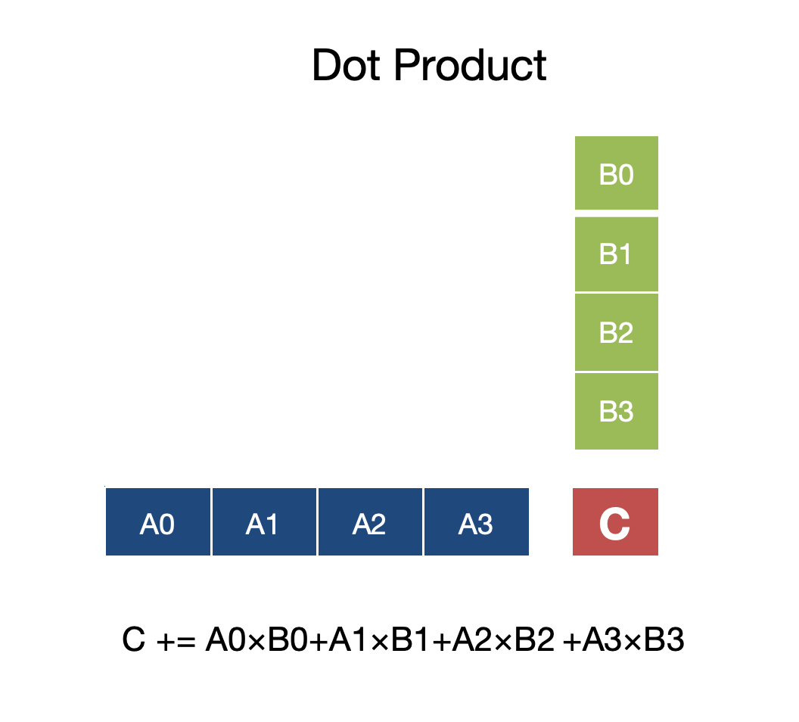
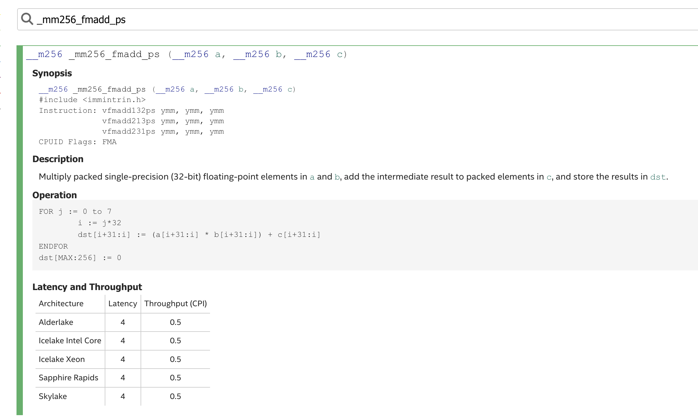

# 使用Z3求解矩阵乘法核大小-基于NEON

在Gemm优化中, 我们会使用多层分块的策略来减少内存的访问, 不同的层级的Tile, 其内存会放在不同的cache上. 而最小一层的Tile我们这里把它称为“Kernel Tile”. Kernel Tile是和向量化指令集紧密联系的, 本文就关注如何使用Z3求解出Kernel Tile的尺寸

## NEON 指令集概述
NEON 是 ARM 架构中的高级 SIMD（Single Instruction, Multiple Data）扩展指令集，广泛应用于 ARMv7-A、ARMv8-A 等架构，用于加速多媒体、信号处理和机器学习任务。
- **向量宽度**：支持 128 位向量寄存器（Q 寄存器），可存储多种数据类型，例如 4 个 32 位浮点数（float32x4_t）、8 个 16 位整数（int16x8_t）等。
- **寄存器**：在 ARMv8-A 架构中，NEON 有 32 个 128 位向量寄存器（Q0-Q31），每个寄存器可以分成两个 64 位部分（D0-D63，共 64 个 D 寄存器）；寄存器可存储浮点数（float32, float64）、整数（int8, int16, int32, int64）、无符号整数以及定点格式数据。
- **指令类型**：包括加载/存储（如 vld1q_f32, vst1q_f32）；算术运算（如加法 vaddq_f32、乘法 vmulq_f32、融合乘加 vfmaq_f32）；逻辑运算（如与 vandq_s32、或 vorrq_s32）；比较和选择（如比较 vceqq_f32、选择 vbslq_f32）；数据重排（如转置 vtrnq_f32、交错 vzipq_f32）；以及归约操作（如 vaddvq_f32）。


#### NEON中的FMA指令
NEON中的融合乘加（FMA, Fused Multiply-Add）指令是NEON指令集中非常重要的一部分，因为它可以将乘法和加法操作融合为一个指令，减少指令依赖、降低延迟，并提升计算吞吐量。

- **功能**：FMA执行`a * b + c`的操作，其中`a`和`b`相乘，结果与`c`相加。
- **优势**：
  - 融合操作：相比单独的乘法（`vmul`）和加法（`vadd`），FMA减少了指令数。
  - 更高的精度：FMA在中间结果上不进行舍入，直接累加，减少了浮点运算的精度损失。
  - 更好的流水线性能：FMA通常有较低的延迟（例如在Cortex-A57上约为4-5周期），且可以并行执行。
- **NEON中的FMA指令**：
  - 主要用于浮点运算（`float32`），也支持定点和整数运算。
  - 常见形式：`vfmaq_f32`（向量FMA）、`vfmaq_laneq_f32`（带广播的FMA）。


## 向量化指令如何实现矩阵乘法

### 内积实现(Dot Product)

内积是通过将一个向量与另一个向量对应元素相乘并累加，最终得到一个标量结果。



例如，在ARM NEON中，可以通过vfmaq_f32计算浮点向量的点积: 
- **场景**：计算`C[i][j] += A[i][k:k+4] * B[k:k+4][j]`（点积）。
- **代码片段**：
  ```c
  float32x4_t a = vld1q_f32(&A[i * K + k]);  // A 的一行
  float32x4_t b;  // B 的一列（逐元素加载）
  b = vsetq_lane_f32(B[k][j], b, 0);
  b = vsetq_lane_f32(B[k+1][j], b, 1);
  b = vsetq_lane_f32(B[k+2][j], b, 2);
  b = vsetq_lane_f32(B[k+3][j], b, 3);
  float32x4_t c = vld1q_f32(&C[i * N + j]);
  c = vfmaq_f32(c, a, b);  // c += a * b
  ```
- **FMA的作用**：
  - `vfmaq_f32` 逐元素计算点积并累加，适合内积实现。


在这种方式下，\( C[i][j] \)  的每个值都是通过对\(A[i][:]\)行和\(B[:][j]\)列的dot product实现。

 

### 外积实现(Out Product)
外积实现是从RAM加载A的一列和B的一行到寄存器中，计算两个向量之间的外积，并将外积的结果添加到矩阵C中。


例如，在ARM NEON中，可以通过带广播的vfmaq_laneq_f32计算浮点向量的外积: 
- **场景**：计算`C = A × B`，`A`是一列（`A[i:i+4,k]`），`B`是一行（`B[k][j:j+4]`），生成4×4小块。
- **代码片段**（参考之前的实现）：
  ```c
  float32x4_t a = vld1q_f32(&A[k * M + i]);  // A 的一列
  float32x4_t b = vld1q_f32(&B[k * N + j]);  // B 的一行
  float32x4x4_t c_tile;
  // 加载 c_tile（C 的 4x4 小块）
  for (int l = 0; l < 4; l++) {
      c_tile.val[l] = vld1q_f32(&C[(i + l) * N + j]);
  }
  // 外积计算
  for (int l = 0; l < 4; l++) {
      c_tile.val[l] = vfmaq_laneq_f32(c_tile.val[l], b, a, l);
  }
  ```


目前主流平台采用的还是外积实现, 其更为简单直接, 并不需要增加特殊的指令
为了便于和下文区分, 我们把基于的外积的上术矩阵乘法实现成为simd kernel. “simd kernel”是我们实际意义上的不可拆分单元,
再拆就无法有效使用向量化指令了. 实际中neon和avx的“simd kernel”是有区别的, 本文会以Neon的实现为例.

## 存在什么问题

### 指令延迟
**指令延迟：** 指令固有的执行时间，一条指令的数据可供另一条指令使用所需的处理器时钟数。


例如在Intel的AVX-512指令([Intel® Intrinsics Guide](https://www.intel.com/content/www/us/en/docs/intrinsics-guide/index.html#ig_expand=4407,3067,3107))中，用于执行融合乘加操作（Fused Multiply-Add）的_mm256_fmadd_ps指令，如图所示：



该指令的延迟是 4 个时钟周期。也就是说，从指令开始执行到其结果准备好供后续指令使用，需要经过 4 个时钟周期。如果后续指令依赖于 _mm256_fmadd_ps 的结果，那么至少需要等待 4 个时钟周期才能继续执行。因此，延迟决定了流水线中的指令之间的时间间隔。

流水线技术可以提高整体的指令吞吐率（单位时间内完成更多指令），但并不能缩短单条指令自身的执行延迟。即使流水线再深，每条指令完成所需的时间（延迟）仍然由指令的复杂性和硬件实现决定。

### 指令流水线


**指令依赖:** 某些指令需等待前序指令完成才能执行。

**流水线:** 一种能使多条指令重叠执行的实现技术。

我们以FMA为例，FMA（Fused Multiply-Add）就是把：

\[
d = a \times b + c
\]
这两步运算（乘法 + 加法）融合成一条指令
简化的FMA流水线的指令执行，如图：
**指令依赖：**


- **FMA的输入值**（a、b、c）**依赖前面的指令结果**，那么就必须等前面的指令执行完。
- 尤其是累加型的循环，比如：
  
  ```c
  for (int i = 0; i < N; ++i)
      sum = sum + a[i] * b[i];
  ```

  这里 sum 是累加的，它每次迭代依赖上一次的 sum。

  用FMA实现：

  ```c
  sum = fma(a[i], b[i], sum);
  ```

  **每一次FMA必须等上一次的sum算完**，所以存在指令依赖，不能乱序执行，形成**流水线停顿**。
  只要是FMA的输入参数来自“前一条FMA输出”，就有指令依赖！

**无指令依赖：**


- FMA的输入值都是独立的，互不相干，互不等待。
- 特别是那种一次性计算多个独立结果，比如矩阵乘法的内部小块计算（小tile），每个位置单独累加。

举例：

```c
// 并行计算不同位置
for (int i = 0; i < 4; ++i)
  for (int j = 0; j < 4; ++j)
    C[i][j] = fma(A[i][k], B[k][j], C[i][j]);
```

在这里：
- 不同的 \( C[i][j] \) 之间是独立的。
- 每个位置的累加是自己的，不依赖别人的结果。


不存依赖的指令, 可以通过指令流水线来掩盖延迟

我们可以看到simd kernel里的计算指令是没有依赖的. 但simd的指令延迟比较大,
如果我们直接把simd kernel应用到分块矩阵乘法中, 就会存在一个问题, 指令数目不足以掩盖指令延迟, 那样性能就无法发挥到极致

## Kernel Tile建模

现在我们把Kernel Tile的问题转化成了一个最优化问题

* 目标: 最大化无依赖的乘加指令
* 约束: 所使用的向量寄存器数量不超过cpu支持的

## 通过Z3求解

### Z3介绍


Z3 是由微软开发的一个高性能 SMT（Satisfiability Modulo Theories）求解器，广泛用于程序验证、自动化推理和约束求解等场景。Z3 支持整数、布尔、实数等类型约束建模。Z3地址：https://github.com/Z3Prover/z3

### 通过z3求解

``` c++

std::tuple<int64_t, int64_t> GetKernelTileShape(std::shared_ptr<ir::TensorType> ir_data_type,
                                                    std::shared_ptr<NativeCpuInfo> cpu_info) {
        int32_t simd_register_count = cpu_info->SimdRegisterCount();
        int32_t simd_lanes = (cpu_info->SimdBits() / 8) / ir_data_type->bytes;
        /// 通过Z3来求解寄存器分块， 该问题不是一个线性规划问题， 所以采用Z3来处理
        z3::context z3_context;
        z3::params z3_params(z3_context);
        z3_params.set("priority", z3_context.str_symbol("register tile"));
        z3::optimize z3_optimize(z3_context);
        z3_optimize.set(z3_params);
        z3::expr z3_register_tile_rows = z3_context.int_const("z3_register_tile_rows");
        z3::expr z3_register_tile_cols = z3_context.int_const("z3_register_tile_cols");
        z3_optimize.add(z3_register_tile_rows > 0);
        z3_optimize.add(z3_register_tile_cols > 0);
        z3_optimize.add(z3_register_tile_rows >= z3_register_tile_cols);
        // z3_register_tile_rows + z3_register_tile_cols : 行和列的寄存器都需要保留，
        // 这样才能复用数据 z3_register_tile_rows * z3_register_tile_cols * int32_t(simd_lanes)：
        // 用于存储外积的结果
        z3_optimize.add(z3_register_tile_rows + z3_register_tile_cols +
                            z3_register_tile_rows * z3_register_tile_cols * simd_lanes <
                        simd_register_count);
        // 最大化无依赖的计算指令数目, 同时也最大化了计算强度
        z3::optimize::handle z3_handle_x =
            z3_optimize.maximize(z3_register_tile_rows * z3_register_tile_cols);
        GALOIS_ASSERT(z3_optimize.check() == z3::sat);
        z3::model z3_model = z3_optimize.get_model();
        auto register_tile_rows = z3_model.eval(z3_register_tile_rows).get_numeral_int64();
        auto register_tile_cols = z3_model.eval(z3_register_tile_cols).get_numeral_int64();
        return {register_tile_rows * simd_lanes, register_tile_cols * simd_lanes};
    }
```

## 总结

总结一下我们方案的优点, 介绍一下其在我们galois项目中的应用. 附上我们galois项目的地址

## 作者介绍

### 孙腾

介绍一下你自己
