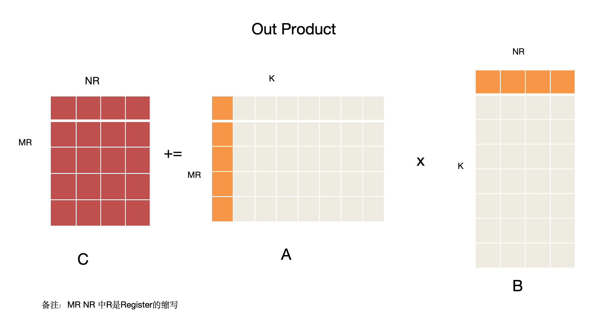

# 从希尔伯特曲线到张量张量

## TensorType类图

```plantuml

RealNumberType --|> TensorType
FloatType --|> RealNumberType
IntType --|> RealNumberType

class RealNumberType{
    bits: int64_t
    bytes: int64_t
}

class IntType {
    signed: bool
}

class TensorType{
    shape: Vector
    layout: LayoutType
    stride: Vector
    value_type: TensorType
}

TensorType::value_type *-- TensorType
' CompositeTensorType --|> TensorType
' SparseTensorType --|> TensorType
```

## 什么是张量(Tensor)

张量(Tensor)可以理解为标量和向量概念的延伸，它是数学中用来描述多维关系的一种对象。在机器学习里，通常把多维的数据叫作张量，并用秩来表示它有多少个方向或维度。图-1简单展示了不同维度的张量：

图-1


### 张量的属性
张量的关键属性有：`shape`,`layout`,`stride`,`value_type`,参考`TensorType`类图：
- **shape**：一个向量，表示张量的维度大小。例如，二维矩阵的 `shape` 为 `(m, n)`，表示 \( m \) 行 \( n \) 列；标量的 `shape` 为空 `()`。
- **layout**：`LayoutType` 类型，描述张量数据在内存中的存储方式，例如行优先（Row-Major）、列优先（Column-Major）。
- **stride**：一个向量，表示从一个元素到下一个元素在内存中的偏移量。例如，在行优先布局的二维张量中，`stride` 可能是 `(n, 1)`，表示跨行跳过 \( n \) 个元素，跨列跳过 1 个元素。
- **value_type**：张量元素的类型，支持嵌套结构（例如，元素本身可以是张量）。通常是 `RealNumberType` 的子类，如 `FloatType` 或 `IntType`，定义了元素的精度（如 `bits` 和 `bytes`）和性质（如 `signed`）。


### 如何表示矩阵
矩阵是二维张量，通常表示一个具有行和列的数组。例如，一个`mxn`的矩阵可以表示为:
\[
A = \begin{bmatrix}
a_{11} & a_{12} & \cdots & a_{1n} \\
a_{21} & a_{22} & \cdots & a_{2n} \\
\vdots & \vdots & \ddots & \vdots \\
a_{m1} & a_{m2} & \cdots & a_{mn}
\end{bmatrix}
\]
在 `TensorType` 中，矩阵的表示依赖其属性：
- **shape**：`(m, n)`，表示 \( m \) 行 \( n \) 列。
- **layout**：通常为行优先（Row-Major），数据按行顺序存储在一维内存中。例如，元素 \( a_{ij} \) 在内存中的偏移量为 \( i \cdot n + j \)（假设 `stride` 为 `(n, 1)`）。
- **stride**：`(n, 1)`（行优先）或 `(1, m)`（列优先），定义了如何从一个元素跳到下一行或下一列。
- **value_type**：通常为 `FloatType`或 `IntType`。


### 如何表示标量

标量也是张量的一种, 属于其退化形式, 我们可以这样表示标量，例如 \( 5 \) 或 \( 3.14 \)。在 `TensorType` 中：
- **shape**：`()`，表示无维度。
- **layout**：无关紧要，因为只有一个元素。
- **stride**：通常为空或未定义。
- **value_type**：如 `FloatType` 或 `IntType`，定义标量的精度和类型。

标量在内存中仅占用单个值，例如一个 32 位浮点数占用 4 字节。


### 内存布局
张量的内存布局(layout)描述了多维数据在一维内存中存储方式，直接影响计算效率。常见的布局包括：
* **行优先(Row-Major)**: 按行顺序存储，shape(3,2,2) 三维张量,按列优先数据布局，如图：
 
* **列优先(Column-Major)**: 按列顺序存储，shape(3,2,2) 三维张量,按列优先数据布局
如图：
 
  


### 我们为什么推荐使用Matrix来表示Vector
向量是一维张量，但推荐使用二维矩阵(如 nx1 或 1xn) 表示向量，原因如下：
* 统一接口: 
* 扩展性:


### 行向量和列向量

- **行向量**：形如 \( [a_1, a_2, \dots, a_n] \)，表示为 \( 1 \times n \) 矩阵，`shape=(1, n)`。
  
- **列向量**：形如 \( \begin{bmatrix} a_1 \\ a_2 \\ \vdots \\ a_n \end{bmatrix} \)，表示为 \( n \times 1 \) 矩阵，`shape=(n, 1)`。
   


## 希尔伯特曲线

希尔伯特曲线是一种类似分形的自相似​​空间填充曲线，由数学家大卫·希尔伯特于 1891 年首次描述。除其他有趣特性外，它还允许通过保持局部性在一维和二维空间之间创建映射：这意味着一维空间中彼此靠近的两个点在二维空间折叠后也会彼此靠近。反之亦然，因为从二维到一维时不可避免地会出现这种情况。然而，即使在这种情况下，曲线也表现出尽可能保持局部性的趋势，这使其成为计算机科学和生物信息学中多种应用的宝贵工具 [1]。
以下是希尔伯特曲线的可视化（引用自 Wikipedia）：


   &nbsp;&nbsp;&nbsp;&nbsp; &nbsp;&nbsp;&nbsp;&nbsp;
图 1 - 希尔伯特曲线，一阶   &nbsp;&nbsp;&nbsp;&nbsp;&nbsp;&nbsp;&nbsp;&nbsp;&nbsp;&nbsp;&nbsp;&nbsp;&nbsp;&nbsp;&nbsp;&nbsp;&nbsp;&nbsp;&nbsp;&nbsp;     图 2 - 希尔伯特曲线，一阶和二阶 &nbsp;&nbsp;&nbsp;&nbsp;&nbsp;&nbsp;&nbsp;&nbsp;图 3 - 希尔伯特曲线，一阶到三阶


     
图 4 - 变体，前三阶迭代  &nbsp;&nbsp;&nbsp;&nbsp;&nbsp;&nbsp;&nbsp;&nbsp;&nbsp;&nbsp;&nbsp;&nbsp;&nbsp;&nbsp;&nbsp;&nbsp;&nbsp;&nbsp;&nbsp;&nbsp;&nbsp;&nbsp;&nbsp;&nbsp;    图 5 - 生产规则 &nbsp;&nbsp;&nbsp;&nbsp;&nbsp;&nbsp;&nbsp;&nbsp;&nbsp; &nbsp;&nbsp;&nbsp;&nbsp;&nbsp;&nbsp;&nbsp;&nbsp;&nbsp; &nbsp;&nbsp;&nbsp;&nbsp;&nbsp;&nbsp;&nbsp;&nbsp;&nbsp; 用颜色显示进度的三维希尔伯特曲线


### 局部连续
希尔伯特曲线的核心特性是局部连续性，即空间上相邻的点在曲线上也接近，优于传统的行优先或列优先遍历（例如蛇形曲线）。这在以下场景中非常有用：

* 缓存优化：在图像处理或张量计算中，希尔伯特曲线遍历数据（如像素或张量元素）可提高缓存命中率，减少内存访问开销。例如，处理一个 shape=(m, n) 的二维张量时，希尔伯特曲线布局可确保相邻元素在内存中更接近。
* 数据压缩：局部连续性使得相邻区域的数据值更可能相似，便于压缩算法（如 JPEG 或稀疏张量压缩）。

### 自相似
希尔伯特曲线具有分形结构，表现出自相似性：局部形状与整体形状相似。这种性质通过递归生成实现：

* 一阶：2×2 网格，形成 U 形曲线（图 1）。
* 二阶：4×4 网格，由四个一阶曲线通过特定旋转和连接组成（图 2）。

## 张量张量
在galois项目中，张量的创建方式非常简单，如：`ir::f32->Tile(2,2)`,若想创建张量张量也非常简单，则只需要:`ir::f32->Tile(2,2)->Tile(3,2)`。下面结合着代码实现简单解释一下：
`Tile` 方法用于创建一个新的 TensorType，其底层类型（`value_type`）是当前的类型，并指定新的形状。
`Tile(2,2)` 调用的是以下模板方法：

```cpp
template <typename... Dims>
std::shared_ptr<TensorType> Tile(Dims... dims) {
    std::array<int64_t, std::tuple_size<std::tuple<Dims...>>::value> shape_array = {dims...};
    Eigen::VectorXi64 shape(shape_array.size());
    std::copy(RANGE(shape_array), shape.begin());
    return TensorType::Create(this->shared_from_this(), shape);
}
```

- 对于 `Tile(2,2)`：
  - 参数 `dims` 是 `2, 2`，因此 `shape_array = {2, 2}`。
  - 创建一个 `Eigen::VectorXi64 shape(2)`，其值为 `[2, 2]`。
  - 调用 `TensorType::Create(this->shared_from_this(), shape)`，其中 `this` 是 `ir::f32`（`FloatType` 类型），`shape = [2, 2]`。

在 `TensorType::Create` 方法中：

```cpp
static std::shared_ptr<TensorType> Create(std::shared_ptr<TensorType> value_type,
                                          Eigen::VectorXi64 shape) {
    return TensorType::Create(value_type, shape, TensorType::GetStride(shape));
}
```

- `value_type` 是 `ir::f32`（标量 `FloatType`）。
- `shape` 是 `[2, 2]`。
- `GetStride(shape)` 计算步幅：`stride = [2, 1]`。
- 创建一个新的 `TensorType`：
  - `value_type = ir::f32`。
  - `shape = [2, 2]`。
  - `stride = [2, 1]`。
 

因此，`ir::f32->Tile(2,2)` 创建一个形状为 `[2, 2]` 的张量，其元素类型为 `f32`。

对形状为 `[2, 2]` 的张量再次调用 `Tile(3,2)`：

- 当前的 `TensorType`：
  - `value_type = ir::f32`（标量 `FloatType`）。
  - `shape = [2, 2]`。
 
- 调用 `Tile(3,2)`：
  - 参数 `dims` 是 `3, 2`，因此 `shape_array = {3, 2}`。
  - 创建 `shape = [3, 2]`。
  - 调用 `TensorType::Create(this->shared_from_this(), shape)`，其中 `this` 是形状为 `[2, 2]` 的 `TensorType`，`shape = [3, 2]`。
- 在 `TensorType::Create` 中：
  - `value_type` 是形状为 `[2, 2]` 的 `TensorType`。
  - `shape = [3, 2]`。
  - `stride = GetStride([3, 2])`：`stride = [2, 1]`。
   
  - 创建新的 `TensorType`：
    - `value_type` 是形状为 `[2, 2]` 的 `TensorType`（其 `value_type` 是 `f32`）。
    - `shape = [3, 2]`。
   
最终张量的 `shape` 是 `[3, 2]`，但其 `value_type` 是一个形状为 `[2, 16]` 的张量（元素为 `f32`），该张量张量的layout如下图所示：


### LLM的关键运算矩阵乘法


[1] Hilbert curve vs Hilbert space: exploiting fractal 2D covering to increase tensor network efficiency https://quantum-journal.org/papers/q-2021-09-29-556/pdf/
[2] https://en.wikipedia.org/wiki/Hilbert_curve#cite_note-3